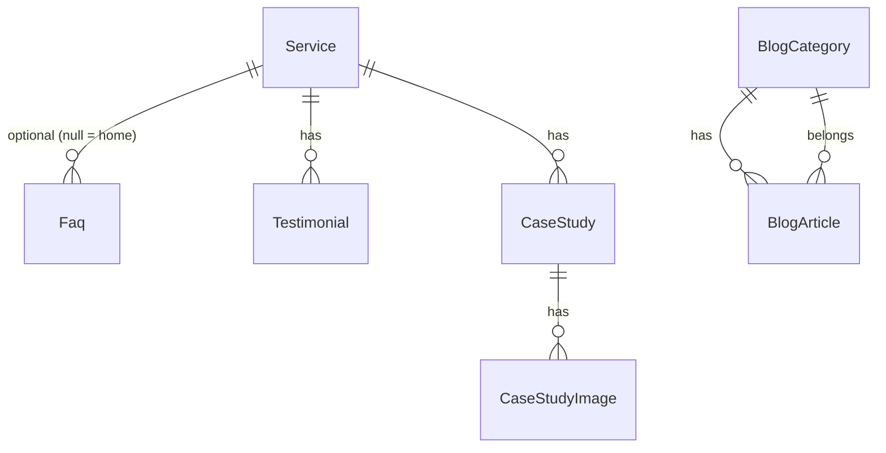

# Phase 1 — Backend: CMS admin panel (all pages)

**References:** [Briefing.md](../Briefing.md) (§18 Phase 2 CMS) · [phase-01.md](./phase-01.md) (post–Phase 1 handoff) · existing public shells (home, services, portfolio, blog)

**Summary:** Plan for a new branch with an admin panel (Inertia + Vue + CoreLayout) that persists and edits services, FAQs, testimonials, portfolio, and blog — normalized entities only. Marketing page copy stays hardcoded in Vue/HTML; site config lives in `.env`.

**Status:** Planning only — not yet implemented.

---

## Context

Today marketing is **100% static**: demo arrays in controllers (`HomeController`, `Portfolio*`, `Blog*`) and **inline** copy in the Vue files for the 5 landings. Only model: `User`. Auth already exists (Fortify + `CoreLayout` + sidebar). Public portfolio/blog shells already exist — the work is **persistence + admin + wiring list/detail props**.

**Branch:** `feat/admin-cms` (from the current branch / aligned `main`).

**Admin stack:** the same Vue 3 + Inertia + Tailwind/reka-ui as the starter (`CoreLayout`, `AppSidebar`). Route prefix `/code/*`, middleware `auth` + `verified`. Controllers live under `App\Http\Controllers\Core`. No RBAC in the MVP (every authenticated user is admin; Fortify registration stays disabled).

**Out of scope:** legal pages (Stage 3), contact form (Stage 6), analytics — only what is needed for the CMS to edit dynamic content that already exists as demos.

**Explicitly not in the database:**
- **Site settings** — email, calendar URL, tagline, location → `.env` / `config` (e.g. `CONTACT_EMAIL`, `CALENDAR_URL`, `FOOTER_TAGLINE`, `LOCATION_LINE`). Header/footer read via `config()` or shared Inertia from env, not a `site_settings` table.
- **Page / landing copy** — home and service landing text stays **hardcoded in Vue/HTML**. Easier to update in code than via CMS. No `pages` / `page_sections` tables.

---

## Database decision (normalized entities only)



| Layer | What | Why |
|--------|--------|---------|
| **Normalized** | `services`, `faqs`, `testimonials`, `case_studies` (+ images), `blog_categories`, `blog_articles` | Listings, publish, ordering, categories; home previews derived from real queries |
| **`.env` / config** | contact email, calendar URL, tagline, location | Site-wide config; not CMS-editable in MVP |
| **Hardcoded Vue/HTML** | Home + 5 service landing copy/structure | Faster to change in templates than schema + admin editors |

**Service ↔ FAQ ↔ Testimonial:**
- `faqs.service_id` **nullable FK** → `services`. When `service_id` is set, the FAQ belongs to that service landing. When `null`, the FAQ belongs to the **home** page.
- `testimonials.service_id` **required FK** → `services`. Every testimonial is tied to a service.
- **Home testimonials:** query published testimonials across services and pick a **random sample** (optionally diversify so multiple services appear), not a dedicated home-only table.
- **Service landing:** show FAQs and testimonials scoped to that `service_id`.

**Golden rule:** portfolio/blog previews on the home page are **not** mirror tables — they come from published `CaseStudy` / `BlogArticle` (`featured` / `published_at` / `limit`). Service cards on home and in nav come from `Service`. Home FAQs = `Faq` where `service_id` is null. Home testimonials = random published testimonials from different services.

**UUID (UI identifier):** every model — including existing `User` — has a unique `uuid` used as the public/UI route key (`getRouteKeyName()` → `uuid`). Keep uuid as primary key for FKs; expose `uuid` only in admin URLs and APIs.

**Uploads:** S3-compatible storage via Sail **MinIO**. Image fields store object keys/URLs (`cover_image`, etc.). Admin upload to default disk (not needed to use Storage::disk()). Briefing: authenticated-only uploads. No Spatie in the MVP.
Requires to update `.env.example` and `.env`

### MinIO (Sail) + `.env`

Add a `minio` service to `compose.yaml` (Sail) and wire Laravel filesystem:

```
FILESYSTEM_DISK=s3
AWS_ACCESS_KEY_ID=sail
AWS_SECRET_ACCESS_KEY=password
AWS_DEFAULT_REGION=us-east-1
AWS_BUCKET=frontporch
AWS_ENDPOINT=http://minio:9000
AWS_URL=http://localhost:9000/frontporch
AWS_USE_PATH_STYLE_ENDPOINT=true
```

Document MinIO console URL/ports in `.env.example`. Create the bucket on first boot (Sail MinIO docs / init script). Tests may use `Storage::fake('s3')` or the same disk config in phpunit.

---

## Scope A — Migrations

Suggested order (one migration per concern, small commits).

**UUID rule:** every table below includes `uuid` (UUID string, unique, indexed). Also migrate `users` to add `uuid`. Auto-generate on create (model boot / `HasUuids`-style helper for the uuid column). Route/model binding uses `uuid`.

1. `add_uuid_to_users_table` — `uuid` unique (backfill existing rows)
2. `create_services_table` — `uuid`, `slug` unique, `title`, `teaser`, `nav_label`, `sort_order`, `is_published`, timestamps
3. `create_faqs_table` — `uuid`, `service_id` nullable FK → `services` (null = home FAQ), `question`, `answer`, `sort_order`, `is_published`
4. `create_testimonials_table` — `uuid`, `service_id` FK → `services` (required), `quote`, `attribution`, `sort_order`, `is_published`
5. `create_case_studies_table` — `uuid`, fields from current `caseStudy` prop + `slug`, `excerpt`, `is_published`, `is_featured`, `published_at`, `sort_order`, `service_id` nullable
6. `create_case_study_images_table` — `uuid`, `case_study_id`, `src`, `alt`, `sort_order`
7. `create_blog_categories_table` — `uuid`, `name`, `slug` unique, `sort_order`
8. `create_blog_articles_table` — `uuid`, `blog_category_id`, `title`, `slug` unique, `excerpt`, `cover_image`, `cover_alt`, `author`, `body` JSON (paragraph/heading/image blocks), `is_published`, `published_at`

Indexes: `uuid` unique; `is_published` + `published_at` / `sort_order` on listings; `faqs.service_id`, `testimonials.service_id`.

---

## Scope B — Models

All models (including `User`) expose `uuid` and use it as the route key.

| Model | Relations / relevant API |
|-------|---------------------------|
| `User` | `uuid` route key (existing auth model) |
| `Service` | `faqs()`, `testimonials()`, `caseStudies()` hasMany; `scopePublished`, ordered |
| `Faq` | `service()` belongsTo (nullable); `scopePublished`, `scopeForHome` (`whereNull('service_id')`), `scopeForService($id)`, ordered |
| `Testimonial` | `service()` belongsTo; `scopePublished`; helper/scope for **random home sample** (e.g. `inRandomOrder()->limit(n)`, optionally one-per-service) |
| `CaseStudy` | `images()`, `service()`; `scopePublished`, `scopeFeatured` |
| `CaseStudyImage` | `caseStudy()` |
| `BlogCategory` | `articles()` |
| `BlogArticle` | `category()`; body cast array; `scopePublished` |

Factories + states: `published`, `unpublished`, `featured` (case study), `withImages`, `withBodyBlocks`, `forHome` / `forService(Service)` (FAQ), `forService(Service)` (testimonial).

Policies (optional in MVP): `auth` is enough; if desired, `AdminContentPolicy` viewAny/update for all authenticated users.

---

## Scope C — Controllers

### Admin (`app/Http/Controllers/Core/`)

Every admin entity uses a **full resource controller** (`index`, `create`, `store`, `show`, `edit`, `update`, `destroy`) with dedicated Form Requests:

| Controller | Notes |
|------------|--------|
| `ServiceController` | Full resource (catalog CRUD) |
| `FaqController` | Full resource |
| `TestimonialController` | Full resource |
| `CaseStudyController` | Full resource + sync of `images[]` where practical |
| `CaseStudyImageController` | Full resource (or nested under case studies; still resource actions) |
| `BlogCategoryController` | Full resource |
| `BlogArticleController` | Full resource |
| `MediaUploadController` | Resource focused on `store` (image validation, returns public URL/key on S3/MinIO) |

### Public (wiring — same CMS delivery)

Replace demos with Eloquent for **dynamic lists/details**, **keeping landing copy hardcoded** in Vue:

- `HomeController` — home FAQs (`service_id` null), services, **random testimonials from different services**, portfolioPreview, blogPreview via queries (section copy stays in the Vue template)
- `Service*Controller` (ideally: **one** `ServiceLandingController` by slug) — loads published `Service` + its FAQs + its testimonials; landing body copy remains in Vue
- `PortfolioController` / `PortfolioStudyCaseController` — `CaseStudy`
- `BlogController` / `BlogArticleController` — `BlogArticle` (+ 404 if unpublished on public route; admin sees drafts)

Admin resources resolve models by `uuid` (not numeric id).

Shared Inertia: `HandleInertiaRequests` can share env-backed config (email, calendarUrl) for header/footer — not DB settings.

---

## Scope D — Views (Inertia / Vue)

**Admin** under `resources/js/pages/core/` + `CoreLayout` layout:

- `core/Dashboard` (optional) or reuse `Dashboard.vue` with CMS cards
- `core/services/Index.vue`, `Create.vue`, `Edit.vue`, `Show.vue`
- `core/faqs/Index.vue`, `Create.vue`, `Edit.vue`, `Show.vue`
- `core/testimonials/Index.vue`, `Create.vue`, `Edit.vue`, `Show.vue`
- `core/case-studies/Index.vue`, `Create.vue`, `Edit.vue`, `Show.vue` (repeatable images)
- `core/case-study-images/*` (if separate resource UI)
- `core/blog/categories/*`, `core/blog/articles/*` (simple body-block editor; full resource pages)

**Nav:** extend `resources/js/components/AppSidebar.vue` — Services, FAQs, Testimonials, Portfolio, Blog. No settings or page-section editors.

**Public:** keep home/service landing copy in Vue/HTML; wire list/detail props from DB. Header/footer read shared env config. Keep existing `data-test` attributes.

Reusable admin components: `ImageUploadField` (S3/MinIO), `BodyBlocksEditor`, `PublishFields` (`is_published` + `published_at`).

---

## Scope E — Routes

New file `routes/core.php` loaded in `bootstrap/app.php` (or `require` in `web.php`) with prefix `code`, name `code.`, middleware `auth`, `verified`:

```
resource   /code/services
resource   /code/faqs
resource   /code/testimonials
resource   /code/case-studies
resource   /code/case-study-images   # or nested under case-studies
resource   /code/blog/categories
resource   /code/blog/articles
resource   /code/media               # primarily POST store
```

Public routes **remain** those in `routes/web.php`; only the data source changes for lists/details. Prefer canonical article route by `slug`; keep `/blog/article/{id}` if useful for admin preview.

Wayfinder: regenerate after core routes.

---

## Scope F — Factories (one per model)

| Factory | States / sequences |
|---------|---------------------|
| `ServiceFactory` | `published`, sequences for the 5 real slugs; |
| `FaqFactory` | `published`, `forHome`, `forService(Service)` |
| `TestimonialFactory` | `published`, `forService(Service)` (required) |
| `CaseStudyFactory` | `published`, `featured`, `withImages(n)` |
| `CaseStudyImageFactory` | |
| `BlogCategoryFactory` | |
| `BlogArticleFactory` | `published`, `unpublished`, realistic body blocks |

---

## Scope G — Seeders

| Seeder | Content |
|--------|----------|
| `ServicesSeeder` | 5 services (slug/title/teaser matching `HomeController` + nav) |
| `FaqsSeeder` | home FAQs (`service_id` null) from `HomeController` + optional per-service FAQs |
| `TestimonialsSeeder` | placeholders tied to services (`service_id` required); enough variety for home random sample |
| `CaseStudiesSeeder` | Cypress & Oak demo case study + images |
| `BlogCategoriesSeeder` | demo article category |
| `BlogArticlesSeeder` | demo article (+ body blocks) |
| `DatabaseSeeder` | calls the above (idempotent with `updateOrCreate` by slug/key) |

Site config values go in `.env` / `.env.example`, not seeders.

Goal: after `migrate --seed`, dynamic public content (services, FAQs, testimonials, portfolio, blog) matches the current demo; landing copy remains as today in Vue.

---

## Scope H — Automated tests

### Feature (Inertia / HTTP)

- Admin auth: guest redirected on all `/code/*`
- Happy-path full resource CRUD + validation failure per resource (Service, Faq, Testimonial, CaseStudy+images, Category, Article); routes use `uuid`
- FAQ: create home FAQ (`service_id` null) vs service-scoped FAQ
- Testimonial: requires `service_id`; home endpoint returns random sample across services
- Media upload to S3 disk: invalid type/size; happy path with `Storage::fake('s3')`
- Public: `assertInertia` on Home/Portfolio/Blog/Service props **from the DB** (factory/seed) for dynamic data
- Unpublished article → 404 on public route; published → 200
- Missing case study → 404

Pattern: mirror `tests/Feature/Http/Controllers/BlogControllerTest.php`.

### Browser (Pest Browser)

- Admin smoke: login → CMS sidebar → open Case Studies / Articles / Services index under `/code`
- Flow: create/edit case study and see it reflected on `/portfolio` (1 critical E2E)
- Flow: publish article and see it on `/blog` + home preview
- Keep existing public smokes; adjust if props change
- Stable selectors `data-test="..."`

### Coverage

Run the suite on Sail + Pint per `.cursor/rules/starting-environment.mdc`; project target 90%, ideal 100%.

---

## Suggested implementation order (incremental commits)

1. Branch `feat/admin-cms`
2. Sail MinIO service + `.env` / `.env.example` S3 config
3. Migrations (users uuid + domain tables) → Models → Factories (by domain: services → faqs/testimonials → case studies → blog)
4. Seeders with current demo content
5. Core routes (`/code`) + resource controllers + views (case studies + articles first — highest ROI from Briefing Phase 2)
6. Wire public portfolio/blog/home preview controllers
7. Media upload (S3/MinIO) + sidebar
8. Feature/Browser tests per domain
9. Docs: mark Phase 2 items in the Briefing when acceptance is OK (separate `docs` commit)

---

## Acceptance criteria

- Authenticated admin CRUD (full resource) for services, FAQs, testimonials, case studies (+ images), categories, and articles under `/core` (bound by `uuid`)
- Controllers live in `App\Http\Controllers\Core`
- FAQs: null `service_id` = home; set `service_id` = service landing. Testimonials always belong to a service; home shows a random cross-service sample
- All models including `User` have a unique `uuid` used as UI/route identifier
- Public list/detail pages read dynamic data from the database (no demo arrays for those entities)
- Home and service landing **copy** remains hardcoded in Vue/HTML
- Site config (email, calendar, tagline, location) comes from `.env`, not a settings table
- Uploads use S3-compatible MinIO via Sail
- Seed reproduces current dynamic demo content
- Feature + Browser covering admin and public wiring; Pint + green tests on Sail

---

## Implementation checklist

- [ ] Create branch `feat/admin-cms`
- [ ] Add Sail `minio` service + configure S3 `.env` / `.env.example`
- [ ] Migrations + Models + Factories (users uuid + services, faqs, testimonials, case studies, blog; UUID route keys)
- [ ] Seeders with current dynamic demo (lists/details equivalent after `migrate --seed`)
- [ ] Put site config keys in `.env.example` (no settings table)
- [ ] Core routes (`/code`) + resource controllers (`App\Http\Controllers\Core`) + views (`CoreLayout` + `AppSidebar`) + S3 media upload
- [ ] Replace public demos for services/FAQs/testimonials/portfolio/blog with Eloquent; share env config via Inertia
- [ ] Keep home/service landing copy hardcoded in Vue
- [ ] Feature + Browser (auth on `/code`, full CRUD, publish/404, portfolio/blog E2E, S3 fake uploads)
- [ ] Update Briefing Phase 2 checklist in a separate docs commit when done
