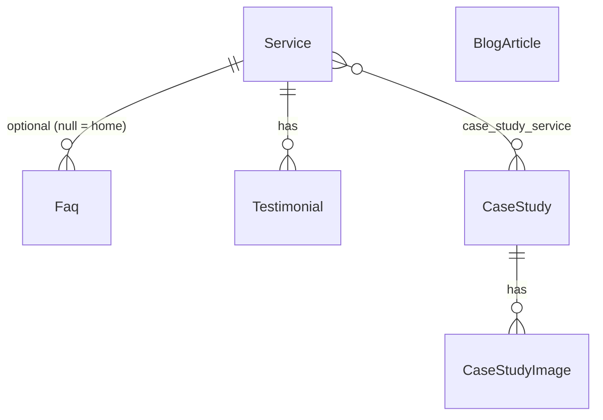

# Phase 1 — Backend: CMS admin panel (all pages)

**References:** [Briefing.md](../Briefing.md) (§18 Phase 2 CMS) · [phase-01.md](./phase-01.md) (post–Phase 1 handoff) · existing public shells (home, services, portfolio, blog)

**Domain interview docs (source of truth while planning):** [phase-01-backend/](./phase-01-backend/) — update the relevant domain file after every interview answer; sync contradictions here and in the Briefing.

**Summary:** Plan for a new branch with an admin panel (Inertia + Vue + CoreLayout) that persists and edits services, FAQs, testimonials, portfolio, and blog — normalized entities only. Marketing page copy stays hardcoded in Vue/HTML; site config lives in `.env`.

**Status:** Domain interviews complete — ready to implement from locked domain docs. Schema and admin depth below should match [phase-01-backend/](./phase-01-backend/).

---

## Context

Today marketing is **100% static**: demo arrays in controllers (`HomeController`, `Portfolio*`, `Blog*`) and **inline** copy in the Vue files for the 5 landings. Only model: `User`. Auth already exists (Fortify + `CoreLayout` + sidebar). Public portfolio/blog shells already exist — the work is **persistence + admin + wiring list/detail props**.

**Branch:** `feat/admin-cms` (from the current branch / aligned `main`).

**Admin stack:** the same Vue 3 + Inertia + Tailwind/reka-ui as the starter (`CoreLayout`, `AppSidebar`). Route prefix `/core/*`, middleware **`auth` only** (no ACL; no `verified` required for CMS). Controllers live under `App\Http\Controllers\Core`. Fortify registration stays disabled; users managed via admin Users CRUD.

**Out of scope:** legal pages (Stage 3), contact form (Stage 6), analytics — only what is needed for the CMS to edit dynamic content that already exists as demos.

**Explicitly not in the database:**
- **Site settings** — `FOOTER_CONTACT_EMAIL`, `CALENDAR_URL` → `.env` / `config`. Footer tagline and location line stay **hardcoded in Vue**. No `site_settings` table.
- **Page / landing copy** — home and service landing text stays **hardcoded in Vue/HTML**. Easier to update in code than via CMS. No `pages` / `page_sections` tables.
- **Blog category taxonomy** — removed (2026-07-29). No `blog_categories` / `BlogCategory` CRUD. Articles may have a free-text `category` string. See [phase-01-backend/blog.md](./phase-01-backend/blog.md).

---

## Domain docs

| Domain | Doc | Interview |
|--------|-----|-----------|
| Blog | [blog.md](./phase-01-backend/blog.md) | Complete |
| Services | [services.md](./phase-01-backend/services.md) | Complete |
| FAQs | [faqs.md](./phase-01-backend/faqs.md) | Complete |
| Testimonials | [testimonials.md](./phase-01-backend/testimonials.md) | Complete |
| Case studies | [case-studies.md](./phase-01-backend/case-studies.md) | Complete |
| Media | [media.md](./phase-01-backend/media.md) | Complete |
| Shared (UUID, env, admin shell) | [shared.md](./phase-01-backend/shared.md) | Complete |

When a domain interview finishes, rewrite that domain’s slices in Scopes A–H below to match locked decisions (and delete leftover overengineering).

---

## Database decision (normalized entities only)

**Case studies (locked):** see [case-studies.md](./phase-01-backend/case-studies.md). UUID PK; SoftDeletes; `slug` Observer + controller comment; `/portfolio/study-case/{slug}`; cover = first gallery image (skip in carousel); `content` like blog; home **6** random; `/portfolio` **15**/page `created_at` desc; admin nested images + services (`show` → 404); no separate image controller.



| Layer | What | Why |
|--------|--------|---------|
| **Normalized** | `services`, `faqs`, `testimonials`, `case_studies` (+ images), `blog_articles` | Listings, publish, ordering; home previews derived from real queries |
| **`.env` / config** | `FOOTER_CONTACT_EMAIL`, `CALENDAR_URL` | Site chrome CTAs/email; tagline/location stay hardcoded in footer Vue |
| **Hardcoded Vue/HTML** | Home + 5 service landing copy/structure | Faster to change in templates than schema + admin editors |

**Service ↔ FAQ ↔ Testimonial:**
- `faqs.service_id` **nullable FK** → `services`. null = **home**; set = **service landing**. Hide empty FAQ sections on landings.
- `testimonials.service_id` **required FK** → `services` (locked). Home: **10** random (`inRandomOrder`). Service landing: **5** random for that service. No `sort_order`.

**FAQs (locked):** see [faqs.md](./phase-01-backend/faqs.md). UUID PK, SoftDeletes, no publish flag. Fields: `question`, `answer`, `sort_order`, nullable `service_id`. Admin resource (`show` → 404).

**Testimonials (locked):** see [testimonials.md](./phase-01-backend/testimonials.md). UUID PK; SoftDeletes; `person`, `testimonial`, required `service_id`; home **10** / landing **5** via `inRandomOrder()`; hide empty sections on home and landings; admin resource (`show` → 404).

**Services (locked):** see [services.md](./phase-01-backend/services.md). UUID PK, SoftDeletes, no publish flag. Catalog: `title`, `description`, `slug` (Observer from title; controller comment), `sort_order`. No `nav_label` (nav uses `title`). Landing copy hardcoded in Vue. Full admin CRUD (`show` → 404). Seeder loads the five current services.

**Golden rule:** portfolio/blog previews on the home page are **not** mirror tables — they come from `CaseStudy` / `BlogArticle` queries (blog: latest **3** by `created_at`; portfolio: **6** random). Service cards on home and in nav come from `Service`. Home FAQs = `Faq` where `service_id` is null. Home testimonials = **10** random across services.

**Blog (locked):** see [blog.md](./phase-01-backend/blog.md). UUID PK, SoftDeletes, no drafts, single `content` format (Markdown preferred; HTML if a dedicated MD parser would be needed only for rendering), required main `image` URL + inline editor uploads via MinIO/S3, `published_by` + `slug` (from title) via Observer, free-text `category`. Public: `/blog` (15/page), `/blog/article/{slug}`, home preview latest 3. Admin resource without Show (`show` → 404). FOSS rich editor (no phone-home).

**UUID:** CMS models + **`User`** use UUID as **primary key** (Shared D2). Admin route binding uses UUID ids.

**Uploads (locked):** see [media.md](./phase-01-backend/media.md). MinIO/S3; uploads on parent form submit only; light validation; paths by domain (`blog/`, `case-studies/`). No dedicated media controller.

### MinIO (Sail) + `.env`

Add a `minio` service to `compose.yaml` (Sail) and wire Laravel filesystem:

```
FILESYSTEM_DISK=s3
AWS_ACCESS_KEY_ID=sail
AWS_SECRET_ACCESS_KEY=password
AWS_DEFAULT_REGION=us-east-1
AWS_BUCKET=frontporch
AWS_ENDPOINT=http://minio:9000
AWS_URL=http://localhost:9000/frontporch
AWS_USE_PATH_STYLE_ENDPOINT=true
```

Document MinIO console URL/ports in `.env.example`. Create the bucket on first boot (Sail MinIO docs / init script). Tests may use `Storage::fake()` or the same disk config in phpunit.

---

## Scope A — Migrations

Suggested order (one migration per concern, small commits). **Provisional** until domain interviews lock schemas.

**UUID rule:** every table below includes `uuid` (UUID string, unique, indexed). Also migrate `users` to add `uuid`. Auto-generate on create. Route/model binding uses `uuid`.

1. `migrate_users_id_to_uuid` — change `users.id` to UUID PK (backfill existing rows); drop separate “add uuid column” approach
2. `create_services_table` — `id` UUID PK, `title`, `description`, `slug` unique (Observer from title), `sort_order`, timestamps, `deleted_at`. No `teaser`, no `nav_label`, no `is_published`, no landing body.
3. `create_faqs_table` — `id` UUID PK, `service_id` nullable FK → `services`, `question`, `answer`, `sort_order`, timestamps, `deleted_at`. No `is_published`.
4. `create_testimonials_table` — `id` UUID PK, `person` (string), `testimonial` (text), `service_id` FK required → `services`, timestamps, `deleted_at`. No `sort_order`, no `is_published`.
5. `create_case_studies_table` — `id` UUID PK, `title`, `slug` unique (Observer from title; controller comment), `description`, `client`, `industry`, `challenge`, `content`, timestamps, `deleted_at`.
6. `create_case_study_service_table` — `case_study_id`, `service_id`, timestamps (unique pair)
7. `create_case_study_images_table` — `id` UUID PK, `case_study_id` FK, `url`, `alt`, `sort_order`, timestamps, `deleted_at`
8. `create_blog_articles_table` — `id` UUID PK, `title`, `slug` unique (Observer from title), `description`, `category` (string), `content` (text; single format — Markdown preferred else HTML per blog D2), `image` (required URL), `published_by` (string, Observer), timestamps, `deleted_at` (soft deletes). No drafts / no `format` column.

Indexes: `uuid` unique; `is_published` + `published_at` / `sort_order` on listings; `faqs.service_id`, `testimonials.service_id`.

---

## Scope B — Models

All models (including `User`) expose `uuid` and use it as the route key.

| Model | Relations / relevant API |
|-------|---------------------------|
| `User` | `uuid` route key (existing auth model) |
| `Service` | SoftDeletes; UUID PK; Observer sets `slug` from `title`; catalog only; landing copy in Vue |
| `Faq` | SoftDeletes; UUID PK; `service()` nullable; home = `whereNull('service_id')` |
| `Testimonial` | SoftDeletes; UUID PK; `service()` required; home/service samples via `inRandomOrder()` |
| `CaseStudy` | SoftDeletes; UUID PK; Observer `slug`; `images()`, `services()` belongsToMany; no publish scopes |
| `CaseStudyImage` | SoftDeletes; UUID PK; `caseStudy()` |
| `BlogArticle` | SoftDeletes; UUID PK; Observer sets `published_by` + `slug` from title on create; route key for public = `slug` |

Factories + states: provisional per domain docs.

Policies (optional in MVP): `auth` is enough.

---

## Scope C — Controllers

### Admin (`app/Http/Controllers/Core/`)

**Provisional** — full resource CRUD may be reduced per domain interview.

| Controller | Notes |
|------------|--------|
| `UserController` | Admin Users CRUD; existing User fields + password confirmation; no SoftDeletes; `show` → 404 |
| `ServiceController` | Full resource like Blog (`show` → 404); create/update comment that Observer sets `slug`; no landing-copy editor |
| `FaqController` | |
| `TestimonialController` | |
| `CaseStudyController` | Resource (`show` → 404); nested images + service sync; Observer comment for `slug` |
| ~~`CaseStudyImageController`~~ | **Dropped** — images on CaseStudy forms only |
| `BlogArticleController` | Admin resource by UUID: index/create/store/edit/update/destroy; **`show` → 404**; `store` comments that Observer sets `published_by` + `slug`; no category controller |
| ~~`MediaUploadController`~~ | **Dropped** — uploads on parent `store`/`update` only (Media D5) |

### Public (wiring — same CMS delivery)

Replace demos with Eloquent for **dynamic lists/details**, **keeping landing copy hardcoded** in Vue:

- `HomeController` — home FAQs, services, testimonials sample, portfolioPreview, blogPreview (**latest 3** articles)
- Service landings — published `Service` + FAQs + testimonials; body copy in Vue
- `PortfolioController` / study-case — `CaseStudy`
- `BlogController` — paginate **15**, `created_at` desc; public article by **`slug`** at `/blog/article/{slug}` (soft-deleted → 404; render `content` as Markdown or HTML)

Admin resources resolve models by UUID PK.

Shared Inertia: `FOOTER_CONTACT_EMAIL`, `CALENDAR_URL` for footer/CTAs — not DB settings. Tagline/location stay hardcoded in footer Vue.

---

## Scope D — Views (Inertia / Vue)

**Admin** under `resources/js/pages/core/` + `CoreLayout` (exact pages TBD per domain):

- Users, Services, FAQs, Testimonials, Case studies, Blog articles
- No blog category taxonomy UI (optional free-text `category` on article form)
- No settings or page-section editors

**Nav:** `AppSidebar` — Users, Services, FAQs, Testimonials, Portfolio, Blog.

**Public:** keep home/service landing copy in Vue/HTML; wire list/detail props from DB. Blog article page renders Markdown/HTML `content`. Keep existing `data-test` attributes.

Reusable admin pieces: image upload to MinIO/S3; FOSS rich text editor for blog `content` (bold, italic, link, blockquote, code, image upload, lists, headings; no phone-home).

---

## Scope E — Routes

New file `routes/core.php` with prefix `core`, name `core.`, middleware **`auth`**:

```
resource   /core/users
resource   /core/services
resource   /core/faqs
resource   /core/testimonials
resource   /core/case-studies
# no separate case-study-images resource
resource   /core/blog/articles
# no dedicated /core/media — uploads on parent form submit (Media D5)
```

Public routes remain in `routes/web.php`; data source changes for lists/details. Blog detail canonical: `/blog/article/{slug}`.

Wayfinder: regenerate after core routes.

---

## Scope F — Factories (one per model)

| Factory | Notes |
|---------|--------|
| `ServiceFactory` | |
| `FaqFactory` | |
| `TestimonialFactory` | |
| `CaseStudyFactory` | |
| `CaseStudyImageFactory` | |
| `BlogArticleFactory` | Markdown/HTML `content` samples; soft-deleted state |

---

## Scope G — Seeders

| Seeder | Content |
|--------|----------|
| `ServicesSeeder` | **Five current services** (slug/title/description matching today’s demos/nav) |
| `FaqsSeeder` | home (+ per-service if kept) |
| `TestimonialsSeeder` | tied to services if that model is kept |
| `CaseStudiesSeeder` | Cypress & Oak demo + images |
| `BlogArticlesSeeder` | demo article |
| `DatabaseSeeder` | calls the above (idempotent) |

Site config in `.env` / `.env.example`, not seeders.

---

## Scope H — Automated tests

### Feature (Inertia / HTTP)

- Admin auth: guest redirected on all `/core/*`
- CRUD + validation per resource that survives interviews; routes use `uuid`
- FAQ / testimonial rules as locked in those domains
- Media upload tests if Media domain keeps an upload endpoint
- Public: `assertInertia` props from DB
- Soft-deleted article → 404; existing article → 200; public page renders content
- Missing case study → 404

### Browser (Pest Browser)

- Admin smoke under `/core`
- Critical E2E: case study → `/portfolio`; create article → `/blog` + home preview
- Stable `data-test` selectors

### Coverage

Sail + Pint per `.cursor/rules/starting-environment.mdc`; target 90%.

---

## Suggested implementation order (incremental commits)

1. Branch `feat/admin-cms`
2. Finish domain interviews → freeze schemas in domain docs + this file
3. Sail MinIO (if Media keeps it) + `.env` / `.env.example`
4. Migrations → Models → Factories by domain
5. Seeders with current demo content
6. Core routes (`/core`) + controllers + views (highest ROI first)
7. Wire public controllers
8. Media + sidebar
9. Feature/Browser tests per domain
10. Docs: Briefing Phase 2 checklist when acceptance is OK (separate `docs` commit)

---

## Acceptance criteria

- Authenticated admin CRUD for entities locked by domain interviews under `/core` (bound by `uuid` if Shared keeps that)
- Controllers in `App\Http\Controllers\Core`
- No blog category taxonomy; blog articles use locked schema in [blog.md](./phase-01-backend/blog.md)
- Public list/detail pages read dynamic data from the database (no demo arrays for those entities)
- Blog: no drafts; SoftDeletes; MinIO/S3 image URLs; `published_by` via Observer
- Home and service landing **copy** remains hardcoded in Vue/HTML
- Site config from `.env`, not a settings table
- Seed reproduces current dynamic demo content
- Feature + Browser + Pint green on Sail

---

## Implementation checklist

- [ ] Domain interviews complete; parent plan synced to locked decisions
- [ ] Create branch `feat/admin-cms`
- [ ] Media/storage decision implemented (MinIO or simpler)
- [ ] Migrations + Models + Factories
- [ ] Seeders with current dynamic demo
- [ ] Site config keys in `.env.example`
- [ ] Core routes (`/core`) + controllers + views + sidebar
- [ ] Replace public demos with Eloquent; share env config via Inertia
- [ ] Keep home/service landing copy hardcoded in Vue
- [ ] Feature + Browser tests
- [ ] Update Briefing Phase 2 checklist in a separate docs commit when done
