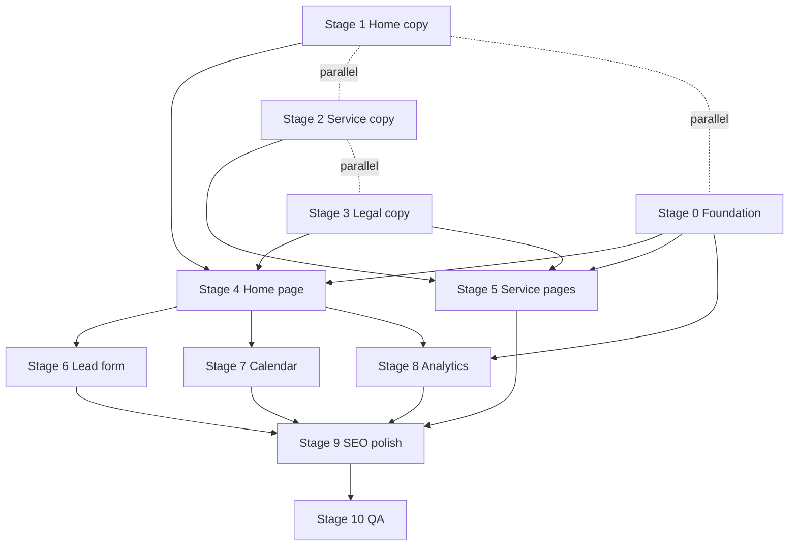

# Phase 1 — Static pages and conversion

**References:** [Briefing.md](../Briefing.md) (§5 sitemap, §6 functional requirements, §18 next steps) · [Design-System.md](../Design-System.md)

**Current state:** Stage 0 foundation and Stage 1 home copy draft in progress on branch `feat/phase-01-stage-0-1`. Theme tokens, fonts, logos, UI primitives (Button, Textarea, Accordion) in code; copy in `docs/content/home-copy.md`. Home page and remaining stages not yet implemented.

**Phase goal:** A launch-ready site that generates qualified leads — long-form home, 5 service landing pages, legal pages, contact form, Calendar scheduling, and consent-gated analytics.

---

## How this plan is organized

The Briefing (§18) lists **8 checklist items** for Phase 1. This plan maps **one stage per checklist item**, plus:

| Stage | Maps to | Role |
|-------|---------|------|
| **Stage 0** | Briefing §18 “Immediate (Pre-Development)” | Technical foundation — must complete before Stage 4 |
| **Stages 1–3** | Checklist items 1–3 | Content only (copy + legal drafts) |
| **Stages 4–8** | Checklist items 4–8 | Implementation (one concern per stage) |
| **Stage 9** | Briefing §10 SEO + polish | Cross-cutting technical SEO after pages exist |
| **Stage 10** | Definition of Done | Final QA and founder sign-off |

Each stage is broken into **small steps** (numbered `X.Y`). Treat one step ≈ one focused commit (or a tiny group). Tests + Pint green at the end of each stage.



**Parallel work:** Stages 1–3 (copy) and Stage 0 (foundation) can run in parallel. Stages 6–8 can overlap after Stage 4 layout exists.

### Content workflow

**Copy lives in `docs/content/`** (Markdown for founder review) — **not** under `resources/`.

| Stage | Review artifact | Wired into app |
|-------|-----------------|----------------|
| 1 | `docs/content/home-copy.md` | Stage 4 |
| 2 | `docs/content/services/{slug}.md` | Stage 5 |
| 3 | `docs/content/legal/privacy.md`, `terms.md` | Stage 3.4 |

Stage 4+ implements a loader (e.g. `App\Support\MarketingContent`) that reads `docs/content/` and passes structured props to Inertia.

**Copy tone (confirmed):** Friendly and approachable (Design System §4.3) — not cold or overly technical. **Geo/SEO specifics** (service area, radius, city lists) belong in **meta tags, service landing pages, and FAQ** — not in hero or main section body copy.

**Contact email:** `MARKETING_CONTACT_EMAIL` in `.env` (see `.env.example`).

---

## Scope and boundaries

### In scope

- Stage 0 through Stage 10 (below)
- Portfolio and Blog home sections as **static placeholders**; `/portfolio` and `/blog` as **empty states** until Phase 2

### Out of scope (Phases 2–3)

- Internal CMS (real portfolio/blog)
- Real testimonials, founder photography
- CRM, newsletter, live chat, payments
- Google Ads / Meta Ads campaigns
- DNS/production deploy (operational; Stage 0 + Stage 10 checklists)

---

## Shared architecture (reference)

### Routes (`routes/web.php`)

| Route | Inertia page | Introduced in |
|-------|--------------|---------------|
| `GET /` | `marketing/Home` | Stage 4 |
| `GET /services/{slug}` | `marketing/services/Show` | Stage 5 |
| `GET /privacy` | `marketing/legal/Privacy` | Stage 3 |
| `GET /terms` | `marketing/legal/Terms` | Stage 3 |
| `GET /portfolio` | `marketing/Portfolio` | Stage 4 (stub) |
| `GET /blog` | `marketing/Blog` | Stage 4 (stub) |
| `POST /contact` | `ContactController@store` | Stage 6 |

**Service slugs:** `lead-generation` · `email-marketing` · `website-design-and-development` · `business-automations` · `custom-software-development`

### Target file structure

```
public/fonts/                          # Montserrat (from docs/branding/)
public/images/branding/                # logo PNGs (web-optimized)
docs/content/                          # copy Markdown (Stages 1–3) — review only until wired in Stage 4+
docs/branding/                         # source fonts + logos
resources/css/app.css                  # brand tokens
resources/js/layouts/MarketingLayout.vue
resources/js/components/marketing/
app/Support/MarketingContent.php       # loads docs/content/ for Inertia (Stage 4)
config/marketing.php
app/Http/Controllers/Marketing/
app/Http/Controllers/ContactController.php
tests/Browser/Marketing/
tests/Feature/ContactFormTest.php
```

---

# Stage 0 — Technical foundation

**Briefing ref:** §18 “Immediate (Pre-Development)” · §8 Branding  
**Goal:** Brand assets and design tokens in code so Stages 4–8 build on a consistent base.  
**Prerequisites:** None (start here or in parallel with Stages 1–3).

### Step 0.1 — Operational setup (founders, non-code)

- [ ] DNS plan: `frontporchcreative.io` canonical; `.agency` / `.marketing` → 301 to `.io`
- [ ] Create GA4, Meta Business/Pixel, Search Console accounts (IDs go in `.env` later)
- [ ] Create Google Calendar scheduling link
- [ ] Basic competitor + keyword research (informs Stages 1–2)
- [ ] Decide on Google Business Profile (Phase 3; note decision)

### Step 0.2 — Brand assets in repo

- [ ] Commit `docs/branding/` (fonts + optimized PNG logos)
- [ ] Copy fonts → `public/fonts/`
- [ ] Copy logos → `public/images/branding/`

### Step 0.3 — Typography and color tokens

- [ ] `@font-face` for Montserrat Alt Thin, Light, SemiBold in `resources/css/app.css`
- [ ] Remove Instrument Sans / Inter CDN from starter pages
- [ ] Tokens: `brand-bg` `#192630`, `brand-accent` `#72887b`, surfaces, borders, semantic colors
- [ ] Expose pending Design System options A–D and L1–L4 as CSS vars; defaults: `--text-on-dark-b`, `--section-light-l1`

### Step 0.4 — Base UI components

- [ ] Customize Reka `Button` variants (primary accent, secondary outline, tertiary link)
- [ ] Install shadcn-vue: `Textarea`, `Accordion` (FAQ in Stage 4)
- [ ] Smoke test: `/` still loads after theme swap (placeholder content OK)

### Stage 0 — Done when

- [ ] Fonts and logos served from `public/`
- [ ] No Instrument Sans / yellow in CSS
- [ ] Button + Textarea + Accordion available for marketing pages

---

# Stage 1 — Home page copy (16 sections)

**Briefing checklist:** “Write home page copy (all 16 sections)”  
**Goal:** Complete English copy for every home section, ready to wire into Vue.  
**Prerequisites:** Briefing §4 (audience), §9 (content), Design System §4.3 (tone). Keyword research (Step 0.1) helps but is not blocking.

**Output location:** `docs/content/home-copy.md`

### Step 1.1 — Page-level SEO and meta

- [ ] `<title>` and meta description (may include region for SEO)
- [ ] Open Graph title, description, placeholder OG image note (placehold.co until real asset)

### Step 1.2 — Section 1: Hero + scheduling CTA

- [ ] Headline (primary value proposition — warm, human)
- [ ] Subhead (benefits in plain language — no ad-style geo/radius copy)
- [ ] Primary CTA label → scheduling (generic: “Book a discovery call” until duration finalized)
- [ ] Secondary CTA label → contact anchor

### Step 1.3 — Section 2: Problems

- [ ] 4–6 pain points (outdated site, no leads, manual processes, fragmented tools)
- [ ] Short intro line tying problems to target audience (Briefing §4)

### Step 1.4 — Section 3: Services

- [ ] One card per service (5 items) with title, 1–2 sentence teaser, link slug
- [ ] Order aligned with SEO priority (Briefing §10) or sitemap order

### Step 1.5 — Section 4: CTA band

- [ ] Headline + body + button label (reusable pattern for sections 7, 10, 13, 15)

### Step 1.6 — Section 5: Portfolio (placeholder content)

- [ ] Section heading + intro (honest “work coming soon” tone if needed)
- [ ] Up to 12 placeholder project titles + one-line descriptions (for static cards)
- [ ] “See more” link label → `/portfolio`

### Step 1.7 — Section 6: Testimonials (placeholder)

- [ ] Copy strategy: “coming soon” / process-focused alternative OR 1–2 generic process quotes (no fake names)
- [ ] Section heading

### Step 1.8 — Section 7: CTA band

- [ ] Variant copy (different angle from §4)

### Step 1.9 — Section 8: How it works

- [ ] 3–5 numbered steps (discovery → strategy → build → measure → iterate)

### Step 1.10 — Section 9: FAQ

- [ ] 6–10 Q&A pairs from Briefing §4 objections (new business, local vs remote, pricing, scope, timeline) — **geo/service area here, not in hero**
- [ ] Accordion-only on home (no dedicated FAQ page)

### Step 1.11 — Section 10: CTA band

- [ ] Variant copy

### Step 1.12 — Section 11: Why Front Porch

- [ ] USP bullets from Briefing §2 (results, custom tech, automation, partnership, integrated view)

### Step 1.13 — Section 12: Who we are

- [ ] Founder story summary (human, Plant City, front porch metaphor)
- [ ] Placeholder photo alt text + caption note

### Step 1.14 — Section 13: CTA band

- [ ] Variant copy

### Step 1.15 — Section 14: Contact

- [ ] Section intro + expectation (response time, what happens next)
- [ ] Calendar mention (session length TBD — generic wording)

### Step 1.16 — Section 15: CTA band

- [ ] Final pre-footer CTA variant

### Step 1.17 — Section 16: Blog preview (placeholder)

- [ ] Section heading
- [ ] 3 placeholder article titles + excerpts + “Read more” labels
- [ ] Link label → `/blog`

### Step 1.18 — Copy review

- [ ] Founder pass: tone, claims, no aggressive hard-sell
- [ ] Consistency check: service names match slugs and Briefing §5

### Stage 1 — Done when

- [ ] All 16 sections have final English copy in `docs/content/home-copy.md`
- [ ] FAQ covers main objections
- [ ] CTA band copy defined for reuse (4 variants minimum)

---

# Stage 2 — Service landing page copy (×5)

**Briefing checklist:** “Write 5 service landing page copies”  
**Goal:** One complete landing page per service for paid + organic traffic.  
**Prerequisites:** Stage 1 service names aligned; Briefing §10 keyword template.

**Output location:** `docs/content/services/{slug}.md` per slug.

### Step 2.1 — Shared template definition

Document required fields for every service page:

- [ ] H1 (service + benefit)
- [ ] Hero subhead
- [ ] 3–5 benefit bullets
- [ ] Process / how we deliver (3–4 steps)
- [ ] Social proof placeholder line (honest, no fake stats)
- [ ] Primary CTA (schedule or contact)
- [ ] SEO: `title`, `description`; local keywords OK on service pages (paid/organic), not required on home body copy
- [ ] FAQ optional (2–3 service-specific questions) — if used, keep on page body, not accordion

### Step 2.2 — `lead-generation` (SEO priority 1)

- [ ] Full copy per template
- [ ] Local keywords: “lead generation [city]” variants in body copy naturally

### Step 2.3 — `email-marketing` (priority 2)

- [ ] Full copy per template

### Step 2.4 — `website-design-and-development` (priority 3)

- [ ] Full copy per template

### Step 2.5 — `business-automations` (priority 4)

- [ ] Full copy per template

### Step 2.6 — `custom-software-development` (priority 5)

- [ ] Full copy per template

### Step 2.7 — Cross-page review

- [ ] No duplicate H1/meta across pages
- [ ] CTAs consistent with home
- [ ] Founder review

### Stage 2 — Done when

- [ ] 5 Markdown files in `docs/content/services/` with complete copy + SEO meta

---

# Stage 3 — Privacy Policy and Terms of Service

**Briefing checklist:** “Draft Privacy Policy and Terms of Service”  
**Goal:** Legal drafts published as readable pages (copy + minimal page shell).  
**Prerequisites:** Stage 0 tokens (for page styling). Can draft copy before Stage 0.

**Output location:** `docs/content/legal/privacy.md`, `docs/content/legal/terms.md`

### Step 3.1 — Privacy Policy draft

- [ ] AI draft covering: data collected (contact form), email delivery, analytics cookies (GA/Meta), US/Florida baseline, contact email, last updated date
- [ ] Sections: Introduction, Information we collect, How we use it, Cookies, Third parties, Your rights, Contact

### Step 3.2 — Terms of Service draft

- [ ] AI draft covering: acceptance, services description, no guarantee of results, limitation of liability, governing law (Florida), contact

### Step 3.3 — Founder legal review

- [ ] Founders read both documents (optional attorney review per Briefing §17)
- [ ] Fix company name, domain, contact details

### Step 3.4 — Routes and page shells

- [ ] `GET /privacy` → `marketing/legal/Privacy.vue` (light bg, `max-w-3xl`, prose styling)
- [ ] `GET /terms` → `marketing/legal/Terms.vue`
- [ ] Controller loads content from `docs/content/legal/` via `MarketingContent` (or equivalent)
- [ ] Footer links to both (if footer exists; else add in Stage 4 and link retroactively)

### Step 3.5 — Browser smoke test

- [ ] Add `/privacy` and `/terms` to `tests/Browser/WebRoutesTest.php`

### Stage 3 — Done when

- [ ] Both legal pages render readable content
- [ ] Routes publicly accessible
- [ ] Founder approved text (or explicitly marked “v1 — review by [date]”)

---

# Stage 4 — Design and implement home page

**Briefing checklist:** “Design and implement home page (Inertia + Vue)”  
**Goal:** Long-form home with all 16 sections, marketing layout, portfolio/blog stubs.  
**Prerequisites:** Stage 0 complete; Stage 1 copy available; Stage 3 legal routes (for footer links).

### Step 4.1 — Marketing layout and navigation

- [ ] `MarketingLayout.vue`: sticky header, footer, default `<Head>` slot
- [ ] `MarketingHeader.vue`: horizontal logo (desktop), nav (Services dropdown, Portfolio, Blog, Contact `#contact`), “Schedule” CTA (href wired in Stage 7)
- [ ] `MarketingFooter.vue`: logo, links, Central Florida service area, Privacy/Terms
- [ ] Mobile: drawer/sheet (Reka Dialog)
- [ ] `data-test` on nav items and primary CTAs

### Step 4.2 — Shared section primitives

- [ ] `SectionShell.vue` (overline, heading, body, slot, optional CTA)
- [ ] `CtaBand.vue` (reusable for sections 4, 7, 10, 13, 15)
- [ ] `MarketingButton.vue` wrapper if needed for external links

### Step 4.3 — Home page scaffold

- [ ] `resources/js/pages/marketing/Home.vue` — composes 16 section components
- [ ] `MarketingContent` (or equivalent) loads `docs/content/home-copy.md` → structured Inertia props
- [ ] `MarketingController@home` passes content to `Home.vue`
- [ ] Route `GET /` replaces `Welcome.vue`

### Step 4.4 — Section 1: Hero

- [ ] `home/HeroSection.vue` — `text-display`, gradient, primary + secondary CTAs
- [ ] Hero stagger animation; respect `prefers-reduced-motion`

### Step 4.5 — Section 2: Problems

- [ ] `home/ProblemsSection.vue` — Lucide icon list

### Step 4.6 — Section 3: Services

- [ ] `home/ServicesSection.vue` — card grid linking to `/services/{slug}`

### Step 4.7 — Sections 4, 7, 10, 13, 15: CTA bands

- [ ] Wire five `CtaBand` instances with distinct copy from Stage 1

### Step 4.8 — Section 5: Portfolio preview

- [ ] `home/PortfolioPreviewSection.vue` — static cards from copy; “See more” → `/portfolio`

### Step 4.9 — Section 6: Testimonials

- [ ] `home/TestimonialsSection.vue` — L1 light background; placeholder copy

### Step 4.10 — Section 8: How it works

- [ ] `home/ProcessSection.vue` — numbered steps

### Step 4.11 — Section 9: FAQ

- [ ] `home/FaqSection.vue` — single-open Accordion

### Step 4.12 — Section 11: Why Front Porch

- [ ] `home/WhySection.vue` — differentiator grid/list

### Step 4.13 — Section 12: Who we are

- [ ] `home/AboutSection.vue` — placeholder image (placehold.co brand colors) + copy

### Step 4.14 — Section 14: Contact (shell only)

- [ ] `home/ContactSection.vue` — section intro + placeholder for form (wired in Stage 6)
- [ ] `id="contact"` anchor for nav

### Step 4.15 — Section 16: Blog preview

- [ ] `home/BlogPreviewSection.vue` — 3 static cards → `/blog`

### Step 4.16 — Scroll motion

- [ ] Scroll reveal on sections; disable when `prefers-reduced-motion`

### Step 4.17 — Portfolio and blog stub pages

- [ ] `GET /portfolio` → empty state + contact CTA (Design System §10.2)
- [ ] `GET /blog` → empty state + CTA
- [ ] Register in `WebRoutesTest.php`

### Step 4.18 — Home browser test

- [ ] `tests/Browser/Marketing/HomeTest.php` — hero visible, FAQ expands, `#contact` anchor, service links work

### Stage 4 — Done when

- [ ] `/` renders all 16 sections with Stage 1 copy
- [ ] Marketing layout on home; mobile nav works
- [ ] Portfolio/blog stubs reachable
- [ ] Home browser test passes

---

# Stage 5 — Service landing pages

**Briefing checklist:** “Implement service landing pages”  
**Goal:** Five SEO/paid-traffic landing pages from one template.  
**Prerequisites:** Stage 0, Stage 2 copy, Stage 4 layout (header/footer).

### Step 5.1 — Config and slug validation

- [ ] `config/marketing.php` — slugs array, labels, mapping to `docs/content/services/{slug}.md`
- [ ] Invalid slug → 404 (Feature test)

### Step 5.2 — Controller and route

- [ ] `MarketingController@showService(string $slug)`
- [ ] `GET /services/{slug}` → `marketing/services/Show.vue`

### Step 5.3 — Page template

- [ ] `Show.vue` — H1, hero, benefits, process, social proof placeholder, single primary CTA
- [ ] Inertia `Head` with per-page title/description from content file
- [ ] Paid-traffic pattern: one primary CTA above fold + repeat at bottom

### Step 5.4 — Implement five pages (content wiring)

- [ ] `lead-generation`
- [ ] `email-marketing`
- [ ] `website-design-and-development`
- [ ] `business-automations`
- [ ] `custom-software-development`

### Step 5.5 — Navigation integration

- [ ] Services dropdown in header links to all 5 slugs
- [ ] Home service cards already link (verify in test)

### Step 5.6 — Browser test

- [ ] `tests/Browser/Marketing/ServicePageTest.php` — priority slug `lead-generation` renders H1 + CTA
- [ ] Feature test: unknown slug 404

### Stage 5 — Done when

- [ ] All 5 URLs live with Stage 2 copy
- [ ] One H1 per page; meta unique per page

---

# Stage 6 — Lead form with email delivery

**Briefing checklist:** “Implement lead form with email delivery”  
**Goal:** Contact form submits to Laravel and sends Gmail notification.  
**Prerequisites:** Stage 4 contact section shell; `.env` mail config.

### Step 6.1 — Form request validation

- [ ] `StoreContactRequest` — name, email, phone, message (all required); email + phone format rules

### Step 6.2 — Controller and route

- [ ] `POST /contact` → `ContactController@store`
- [ ] Rate limit (e.g. 5/min per IP)
- [ ] Optional honeypot field

### Step 6.3 — Mailable

- [ ] `LeadNotification` mailable
- [ ] `resources/views/emails/lead-notification.blade.php`
- [ ] Recipient: `MAIL_LEAD_RECIPIENT` env var

### Step 6.4 — Frontend form

- [ ] `ContactForm.vue` — Reka Input/Label/Textarea
- [ ] `data-test="contact-name"`, `contact-email`, `contact-phone`, `contact-message`, `contact-submit`
- [ ] Success and error feedback (inline or toast)
- [ ] Wire into `ContactSection.vue`

### Step 6.5 — Tests

- [ ] `tests/Feature/ContactFormTest.php` — validation errors, Mail::fake success
- [ ] Browser test — happy path submit (mail mocked)

### Stage 6 — Done when

- [ ] Form on home submits and sends email
- [ ] Validation and throttle verified by tests

---

# Stage 7 — Google Calendar redirect

**Briefing checklist:** “Integrate Google Calendar redirect”  
**Goal:** All scheduling CTAs open the external Calendar link in a new tab.  
**Prerequisites:** Step 0.1 Calendar link; Stage 4 header/hero CTAs exist.

### Step 7.1 — Config

- [ ] `config/marketing.php` → `'calendar_url' => env('MARKETING_CALENDAR_URL')`
- [ ] Document in `.env.example`

### Step 7.2 — CTA wiring

- [ ] Header “Schedule” button → `calendar_url`
- [ ] Hero primary CTA → `calendar_url`
- [ ] Service page primary CTAs → `calendar_url` (or contact — pick one pattern and stay consistent; Briefing favors scheduling)
- [ ] `target="_blank"` + `rel="noopener noreferrer"` + ExternalLink icon where appropriate

### Step 7.3 — Copy notice (optional)

- [ ] If session duration still TBD, keep generic “Book a discovery call” (Briefing §6 note)

### Step 7.4 — Test

- [ ] Feature or Browser test: scheduling link `href` matches config (no need to hit Google)

### Stage 7 — Done when

- [ ] Every “Schedule” / primary booking CTA uses `MARKETING_CALENDAR_URL`
- [ ] Link opens in new tab

---

# Stage 8 — GA, Meta Pixel, and cookie consent

**Briefing checklist:** “Add GA and Meta Pixel with cookie consent banner”  
**Goal:** Analytics load only after explicit consent.  
**Prerequisites:** Stage 0; Stage 4 layout (banner placement); GA/Meta IDs in `.env`.

### Step 8.1 — Config

- [ ] `google_analytics_id`, `meta_pixel_id` in `config/marketing.php`
- [ ] `.env.example` entries

### Step 8.2 — Cookie consent UI

- [ ] `CookieConsent.vue` — overlay bar; Accept / Reject; link to `/privacy`
- [ ] Persist choice in `localStorage`
- [ ] `data-test="cookie-accept"`, `cookie-reject`

### Step 8.3 — Analytics loader

- [ ] `AnalyticsScripts.vue` — inject GA4 + Meta Pixel only when accepted
- [ ] Mount from `MarketingLayout.vue`

### Step 8.4 — Tests

- [ ] Feature test: reject → no analytics scripts in response
- [ ] Feature test: accept → IDs present in HTML (mocked IDs)

### Stage 8 — Done when

- [ ] Banner shows on first visit
- [ ] Reject blocks scripts; Accept loads both tags

---

# Stage 9 — Technical SEO and polish

**Goal:** Search engines and social previews see a complete, branded site.  
**Prerequisites:** Stages 4–8 complete.

### Step 9.1 — Per-page Head audit

- [ ] Unique `<title>` + meta description on home, 5 services, privacy, terms, stubs

### Step 9.2 — Open Graph

- [ ] `og:title`, `og:description`, `og:url`, placeholder `og:image`

### Step 9.3 — Structured data

- [ ] JSON-LD: `Organization`, `LocalBusiness` (Plant City, FL)
- [ ] `FAQPage` schema on home (matches FAQ content)

### Step 9.4 — Crawling

- [ ] `public/robots.txt`
- [ ] `public/sitemap.xml` — all Phase 1 URLs

### Step 9.5 — Favicon and cleanup

- [ ] Favicon from brand logo
- [ ] Remove `Welcome.vue` and starter references
- [ ] CTA contrast review (accent button text color — WCAG)

### Step 9.6 — Open design decisions

- [ ] Confirm text-on-dark variant (default B)
- [ ] Confirm light section bg (default L1)
- [ ] Logo horizontal on mobile — confirm scaled horizontal

### Stage 9 — Done when

- [ ] sitemap lists all public routes
- [ ] No Laravel starter branding remains

---

# Stage 10 — QA and acceptance

**Goal:** Phase 1 meets Briefing success criteria and repo quality gates.

### Step 10.1 — Automated gates

```bash
./vendor/bin/sail npm run build
./vendor/bin/sail artisan test --parallel --coverage --min=90
./vendor/bin/sail exec laravel.test vendor/bin/pint --parallel
```

### Step 10.2 — Manual smoke checklist

- [ ] Home: all 16 sections, portfolio/blog placeholders
- [ ] 5 service pages + legal pages
- [ ] Contact form → email received (staging mail or log driver test)
- [ ] Schedule CTAs → Calendar
- [ ] Cookie banner → analytics gating
- [ ] Mobile header + contact form usable

### Step 10.3 — Founder sign-off

- [ ] Marketing copy approved
- [ ] Privacy + Terms approved
- [ ] `.env` production values documented (not committed)

### Phase 1 — Definition of Done

- [ ] All Stage 1–10 checklists complete
- [ ] Browser tests: public routes, home, contact, one service page
- [ ] Brand theme applied throughout

---

## Risks and mitigation

| Risk | Mitigation |
|------|------------|
| No real portfolio/testimonials | Stages 1.6–1.7 honest placeholders; strong FAQ (1.10) and Who we are (1.13) |
| Copy blocks implementation | Stages 1–3 parallel with Stage 0; Stage 4 can use draft copy with `[TBD]` flags |
| Brand assets missing | Stage 0.2 blocks Stage 4 |
| No staging environment | Stage 10 automated tests + production build before deploy |
| Gmail for leads | Acceptable MVP; WorkMail later |

---

## Post–Phase 1 (handoff to Phase 2)

See Briefing §18 Phase 2: internal CMS, full portfolio/blog, home sections wired to real content.

---

## Operational checklist (founders — production go-live)

Non-code items (overlap with Step 0.1; re-verify before launch):

- [ ] DNS live: `.io` canonical; redirects from `.agency` / `.marketing`
- [ ] `GOOGLE_ANALYTICS_ID`, `META_PIXEL_ID`, `MARKETING_CALENDAR_URL` set in production
- [ ] Search Console verified
- [ ] Google Business Profile (if decided)
- [ ] Founder review: copy + legal (Stage 10.3)
