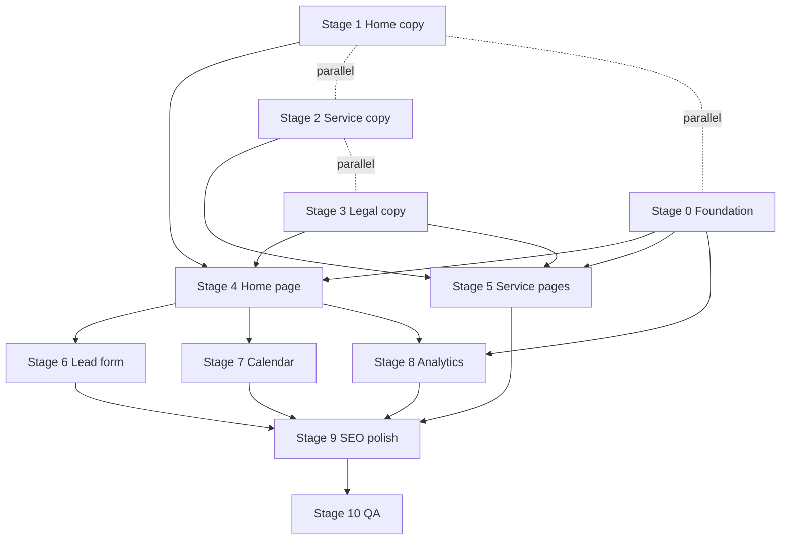

# Phase 1 — Static pages and conversion

**References:** [Briefing.md](../Briefing.md) (§5 sitemap, §6 functional requirements, §18 next steps) · [Design-System.md](../Design-System.md)

**Current state (2026-07-29):** Stages **0 (code), 1, 2, 4, and 5** are implemented on `main` / current branch. Home + five service landings + marketing layout ship with **inline copy** (not `docs/content/`). Portfolio and blog exist as **static demo pages** (ahead of Briefing Phase 2 CMS). **Still open:** Stage 0.1 (founders/ops), Stage 3 (legal), Stages 6–8 (form, calendar URL, analytics/consent), Stage 9 polish leftovers, Stage 10 QA.

**Phase goal:** A launch-ready site that generates qualified leads — long-form home, 5 service landing pages, legal pages, contact form, Calendar scheduling, and consent-gated analytics.

---

## How this plan is organized

The Briefing (§18) lists **8 checklist items** for Phase 1. This plan maps **one stage per checklist item**, plus:

| Stage | Maps to | Role | Status |
|-------|---------|------|--------|
| **Stage 0** | Briefing §18 “Immediate (Pre-Development)” | Technical foundation | Code done; ops (0.1) open |
| **Stages 1–3** | Checklist items 1–3 | Content only (copy + legal drafts) | 1–2 done; **3 open** |
| **Stages 4–8** | Checklist items 4–8 | Implementation | **4–5 done;** **6–8 open** |
| **Stage 9** | Briefing §10 SEO + polish | Cross-cutting technical SEO | Partial |
| **Stage 10** | Definition of Done | Final QA and founder sign-off | Open |

Each stage is broken into **small steps** (numbered `X.Y`). Treat one step ≈ one focused commit (or a tiny group). Tests + Pint green at the end of each stage.



**Parallel work:** Stages 1–3 (copy) and Stage 0 (foundation) can run in parallel. Stages 6–8 can overlap after Stage 4 layout exists.

### Content workflow

**Original plan:** copy in `docs/content/` Markdown for founder review, then loaded via `App\Support\MarketingContent`.

**As implemented:** marketing copy is **inlined** in Vue templates and controller demo arrays (`HomeController`, service page components). `docs/content/home-copy.md` was removed after sync. Do **not** reintroduce a Markdown loader unless product needs founder-editable files again.

| Stage | Review artifact (plan) | As implemented |
|-------|------------------------|----------------|
| 1 | `docs/content/home-copy.md` | Inline in `resources/js/pages/home/**` + `HomeController` |
| 2 | `docs/content/services/{slug}.md` | Inline in each `resources/js/pages/service-*/**` |
| 3 | `docs/content/legal/*.md` | **Not started** — still preferred for legal drafts |

**Copy tone (confirmed):** Friendly and approachable (Design System §4.3) — not cold or overly technical. **Geo/SEO specifics** (service area, radius, city lists) belong in **meta tags, service landing pages, and FAQ** — not in hero or main section body copy.

**Contact email:** `FOOTER_CONTACT_EMAIL` in `.env` (see `.env.example`; was `MARKETING_CONTACT_EMAIL`). UI still uses placeholder `contact@example.com` until wired.

---

## Scope and boundaries

### In scope

- Stage 0 through Stage 10 (below)
- Portfolio and Blog: Phase 1 originally called for **static placeholders / empty states**

### Ahead of plan (static demos — not CMS)

Already in the repo (Briefing Phase 2 shells, demo data, no Eloquent CMS):

- `GET /portfolio` — listing with demo case studies
- `GET /portfolio/study-case/{id}` — study case detail
- `GET /blog` — listing with demo articles
- `GET /blog/article/{id}` and `GET /blog/{slug}` — article detail

Treat these as **static Phase-2-ahead UI**. Real CMS, models, and founder content remain Phase 2–3.

### Out of scope (Phases 2–3)

- Internal CMS (real portfolio/blog persistence)
- Real testimonials, founder photography
- CRM, newsletter, live chat, payments
- Google Ads / Meta Ads campaigns
- DNS/production deploy (operational; Stage 0 + Stage 10 checklists)

---

## Shared architecture (reference)

### Routes (`routes/web.php`) — as implemented

| Route | Inertia page | Status |
|-------|--------------|--------|
| `GET /` | `home/Home` | Done (Stage 4) |
| `GET /services/lead-generation` | `service-lead-generation/ServiceLeadGeneration` | Done |
| `GET /services/email-marketing` | `service-email-marketing/ServiceEmailMarketing` | Done |
| `GET /services/website-design-and-development` | `service-website-design-and-development/ServiceWebsiteDesignAndDevelopment` | Done |
| `GET /services/business-automations` | `service-business-automations/ServiceBusinessAutomations` | Done |
| `GET /services/custom-software-development` | `service-custom-software-development/ServiceCustomSoftwareDevelopment` | Done |
| `GET /portfolio` | `portfolio/Portfolio` | Done (demo listing) |
| `GET /portfolio/study-case/{id}` | `portfolio-study-case/PortfolioStudyCase` | Done (demo) |
| `GET /blog` | `blog/Blog` | Done (demo listing) |
| `GET /blog/article/{id}`, `GET /blog/{slug}` | `blog-article/BlogArticle` | Done (demo) |
| `GET /privacy` | — | **Missing** (Stage 3) |
| `GET /terms` | — | **Missing** (Stage 3) |
| `POST /contact` | — | **Missing** (Stage 6) |

**Service slugs:** `lead-generation` · `email-marketing` · `website-design-and-development` · `business-automations` · `custom-software-development`

### Architecture notes (plan vs code)

| Planned | As implemented |
|---------|----------------|
| `MarketingLayout.vue` / `marketing/*` pages | `AppLayout` + `layouts/app/SiteHeader.vue` / `SiteFooter.vue` |
| Single `MarketingController` + `MarketingContent` | Per-page invokable controllers (`HomeController`, `Service*Controller`, …) |
| `docs/content/` Markdown loader | Inline copy in Vue / controller arrays |
| `GET /services/{slug}` dynamic | Explicit routes per slug |
| Empty `/portfolio` and `/blog` stubs | Full static demo listings + detail pages |
| `config/marketing.php` | **Not created yet** (needed for Stages 7–8) |

### Target / actual file structure

```
public/fonts/                          # Montserrat — DONE
public/images/branding/                # logos — DONE
docs/branding/                         # source fonts + logos — DONE
docs/content/                          # DROPPED for marketing copy; still OK for Stage 3 legal drafts
resources/css/app.css                  # brand tokens — DONE
resources/js/layouts/AppLayout.vue     # marketing shell — DONE
resources/js/layouts/app/              # SiteHeader, SiteFooter, SectionShell, CtaBand, CtaButton, …
resources/js/pages/home/               # Home + section components — DONE
resources/js/pages/service-*/          # five service pages — DONE
resources/js/pages/portfolio*/         # demo portfolio — DONE (ahead)
resources/js/pages/blog*/              # demo blog — DONE (ahead)
config/marketing.php                   # TODO (Stages 7–8)
app/Http/Controllers/ContactController.php  # TODO (Stage 6)
tests/Feature/ContactFormTest.php      # TODO (Stage 6)
tests/Browser/Http/…                   # page smoke/feature tests — largely DONE for existing pages
```

---

# Stage 0 — Technical foundation

**Briefing ref:** §18 “Immediate (Pre-Development)” · §8 Branding  
**Goal:** Brand assets and design tokens in code so Stages 4–8 build on a consistent base.  
**Prerequisites:** None (start here or in parallel with Stages 1–3).  
**Status:** Code complete; founder/ops items open.

### Step 0.1 — Operational setup (founders, non-code)

- [ ] DNS plan: `frontporchcreative.io` canonical; `.agency` / `.marketing` → 301 to `.io`
- [ ] Create GA4, Meta Business/Pixel, Search Console accounts (IDs go in `.env` later)
- [ ] Create Google Calendar scheduling link
- [ ] Basic competitor + keyword research (informs Stages 1–2)
- [ ] Decide on Google Business Profile (Phase 3; note decision)

### Step 0.2 — Brand assets in repo

- [x] Commit `docs/branding/` (fonts + optimized PNG logos)
- [x] Copy fonts → `public/fonts/`
- [x] Copy logos → `public/images/branding/`

### Step 0.3 — Typography and color tokens

- [x] `@font-face` for Montserrat Alt Thin, Light, SemiBold in `resources/css/app.css`
- [x] Remove Instrument Sans / Inter CDN from starter pages (active marketing pages use brand fonts)
- [x] Tokens: `brand-bg` `#192630`, `brand-accent` `#72887b`, surfaces, borders, semantic colors
- [x] Expose pending Design System options A–D and L1–L4 as CSS vars; defaults: `--text-on-dark-b`, `--section-light-l1`

### Step 0.4 — Base UI components

- [x] Customize Reka `Button` variants (primary accent, secondary outline, tertiary link)
- [x] Install shadcn-vue: `Textarea`, `Accordion` (FAQ in Stage 4)
- [x] Smoke test: `/` still loads after theme swap

### Stage 0 — Done when

- [x] Fonts and logos served from `public/`
- [x] No Instrument Sans / yellow in marketing CSS tokens
- [x] Button + Textarea + Accordion available for marketing pages
- [ ] Step 0.1 founder/ops items (not blocking further code stages)

---

# Stage 1 — Home page copy (16 sections)

**Briefing checklist:** “Write home page copy (all 16 sections)”  
**Goal:** Complete English copy for every home section, ready to wire into Vue.  
**Prerequisites:** Briefing §4 (audience), §9 (content), Design System §4.3 (tone). Keyword research (Step 0.1) helps but is not blocking.  
**Status:** Done in app (inline). Markdown review file removed.

**Output location (as implemented):** `resources/js/pages/home/**` + `app/Http/Controllers/HomeController.php`

### Step 1.1 — Page-level SEO and meta

- [x] `<title>` and meta description (may include region for SEO)
- [ ] Open Graph title, description, placeholder OG image note (home still lighter than service pages)

### Step 1.2 — Section 1: Hero + scheduling CTA

- [x] Headline (primary value proposition — warm, human)
- [x] Subhead (benefits in plain language — no ad-style geo/radius copy)
- [x] Primary CTA label → scheduling (generic: “Book a discovery call” until duration finalized)
- [x] Secondary CTA label → contact anchor

### Step 1.3 — Section 2: Problems

- [x] 4–6 pain points (outdated site, no leads, manual processes, fragmented tools)
- [x] Short intro line tying problems to target audience (Briefing §4)

### Step 1.4 — Section 3: Services

- [x] One card per service (5 items) with title, 1–2 sentence teaser, link slug
- [x] Order aligned with SEO priority (Briefing §10) or sitemap order

### Step 1.5 — Section 4: CTA band

- [x] Headline + body + button label (reusable pattern for sections 7, 10, 13, 15)

### Step 1.6 — Section 5: Portfolio (placeholder content)

- [x] Section heading + intro
- [x] Placeholder project cards (static / demo)
- [x] “See more” link label → `/portfolio`

### Step 1.7 — Section 6: Testimonials (placeholder)

- [x] Placeholder / process-focused quotes (no fake client claims required)
- [x] Section heading

### Step 1.8 — Section 7: CTA band

- [x] Variant copy (different angle from §4)

### Step 1.9 — Section 8: How it works

- [x] Numbered steps (discovery → strategy → build → measure → iterate)

### Step 1.10 — Section 9: FAQ

- [x] Q&A pairs from Briefing §4 objections — geo/service area in FAQ, not hero
- [x] Accordion-only on home (no dedicated FAQ page)

### Step 1.11 — Section 10: CTA band

- [x] Variant copy

### Step 1.12 — Section 11: Why Front Porch

- [x] USP bullets from Briefing §2

### Step 1.13 — Section 12: Who we are

- [x] Founder story summary (human, Plant City, front porch metaphor)
- [x] Placeholder photo alt text

### Step 1.14 — Section 13: CTA band

- [x] Variant copy

### Step 1.15 — Section 14: Contact

- [x] Section intro + expectation (response time, what happens next)
- [x] Calendar mention (generic wording; form still Stage 6)

### Step 1.16 — Section 15: CTA band

- [x] Final pre-footer CTA variant

### Step 1.17 — Section 16: Blog preview (placeholder)

- [x] Section heading
- [x] Placeholder article cards + link → `/blog`

### Step 1.18 — Copy review

- [ ] Founder pass: tone, claims, no aggressive hard-sell
- [x] Consistency check: service names match slugs and Briefing §5

### Stage 1 — Done when

- [x] All 16 sections have English copy in the app
- [x] FAQ covers main objections
- [x] CTA band copy defined for reuse (5 variants on home)
- [ ] Founder formal sign-off (Stage 10.3)

---

# Stage 2 — Service landing page copy (×5)

**Briefing checklist:** “Write 5 service landing page copies”  
**Goal:** One complete landing page per service for paid + organic traffic.  
**Prerequisites:** Stage 1 service names aligned; Briefing §10 keyword template.  
**Status:** Done — copy inlined per service Vue page (+ assets).

**Output location (as implemented):** `resources/js/pages/service-{slug}/**`

### Step 2.1 — Shared template definition

Document required fields for every service page:

- [x] H1 (service + benefit)
- [x] Hero subhead
- [x] Benefit bullets / sections
- [x] Process / how we deliver
- [x] Social proof placeholder line (honest, no fake stats)
- [x] Primary CTA (schedule or contact)
- [x] SEO: `title`, `description`; OG tags on service pages
- [x] Service-specific body content pattern shared across five pages

### Step 2.2 — `lead-generation` (SEO priority 1)

- [x] Full copy per template

### Step 2.3 — `email-marketing` (priority 2)

- [x] Full copy per template

### Step 2.4 — `website-design-and-development` (priority 3)

- [x] Full copy per template

### Step 2.5 — `business-automations` (priority 4)

- [x] Full copy per template

### Step 2.6 — `custom-software-development` (priority 5)

- [x] Full copy per template

### Step 2.7 — Cross-page review

- [x] No duplicate H1/meta across pages (unique per service)
- [x] CTAs consistent with home patterns
- [ ] Founder review

### Stage 2 — Done when

- [x] 5 service pages live with complete copy + SEO meta
- [ ] Founder formal sign-off (Stage 10.3)

---

# Stage 3 — Privacy Policy and Terms of Service

**Briefing checklist:** “Draft Privacy Policy and Terms of Service”  
**Goal:** Legal drafts published as readable pages (copy + minimal page shell).  
**Prerequisites:** Stage 0 tokens (for page styling). Can draft copy before Stage 0.  
**Status:** **Not started** — footer has no Privacy/Terms links yet.

**Output location:** Prefer `docs/content/legal/privacy.md`, `docs/content/legal/terms.md` (or inline if matching current marketing pattern).

### Step 3.1 — Privacy Policy draft

- [ ] AI draft covering: data collected (contact form), email delivery, analytics cookies (GA/Meta), US/Florida baseline, contact email, last updated date
- [ ] Sections: Introduction, Information we collect, How we use it, Cookies, Third parties, Your rights, Contact

### Step 3.2 — Terms of Service draft

- [ ] AI draft covering: acceptance, services description, no guarantee of results, limitation of liability, governing law (Florida), contact

### Step 3.3 — Founder legal review

- [ ] Founders read both documents (optional attorney review per Briefing §17)
- [ ] Fix company name, domain, contact details

### Step 3.4 — Routes and page shells

- [ ] `GET /privacy` → legal Privacy page (light bg, `max-w-3xl`, prose styling)
- [ ] `GET /terms` → legal Terms page
- [ ] Controller loads content (Markdown or inline consistent with project)
- [ ] Footer links to both (`SiteFooter.vue`)

### Step 3.5 — Browser smoke test

- [ ] Add `/privacy` and `/terms` to browser/route smoke coverage

### Stage 3 — Done when

- [ ] Both legal pages render readable content
- [ ] Routes publicly accessible
- [ ] Founder approved text (or explicitly marked “v1 — review by [date]”)

---

# Stage 4 — Design and implement home page

**Briefing checklist:** “Design and implement home page (Inertia + Vue)”  
**Goal:** Long-form home with all 16 sections, marketing layout, portfolio/blog stubs.  
**Prerequisites:** Stage 0 complete; Stage 1 copy available; Stage 3 legal routes (for footer links).  
**Status:** **Done** (layout + 16 sections). Legal footer links still depend on Stage 3. Portfolio/blog are full demos, not empty stubs.

### Step 4.1 — Marketing layout and navigation

- [x] Marketing shell via `AppLayout` + sticky `SiteHeader` / `SiteFooter`
- [x] Header: horizontal logo, Services dropdown, Portfolio, Blog, Contact `#contact`, Schedule CTA
- [x] Footer: logo, links, Central Florida service area (Privacy/Terms pending Stage 3)
- [x] Mobile: drawer/sheet (Dialog)
- [x] `data-test` on nav items and primary CTAs

### Step 4.2 — Shared section primitives

- [x] `SectionShell.vue` (overline, heading, body, slot, optional CTA)
- [x] `CtaBand.vue` (reusable for sections 4, 7, 10, 13, 15)
- [x] `CtaButton.vue` wrapper for schedule / anchor links

### Step 4.3 — Home page scaffold

- [x] `resources/js/pages/home/Home.vue` — composes section components
- [x] Content via controller props + inline section copy (no Markdown loader)
- [x] `HomeController` passes content to `Home.vue`
- [x] Route `GET /` → home (Welcome no longer the public landing)

### Step 4.4 — Section 1: Hero

- [x] `home/component/HeroSection.vue` — display type, gradient, primary + secondary CTAs
- [x] Hero motion via `motion-safe:*`; respects reduced motion utilities

### Step 4.5 — Section 2: Problems

- [x] `home/component/ProblemsSection.vue`

### Step 4.6 — Section 3: Services

- [x] `home/component/ServicesSection.vue` — cards linking to `/services/{slug}`

### Step 4.7 — Sections 4, 7, 10, 13, 15: CTA bands

- [x] Five `CtaBand` instances with distinct copy

### Step 4.8 — Section 5: Portfolio preview

- [x] `home/component/PortfolioPreviewSection.vue` — “See more” → `/portfolio`

### Step 4.9 — Section 6: Testimonials

- [x] `home/component/TestimonialsSection.vue` — light section + placeholder copy

### Step 4.10 — Section 8: How it works

- [x] `home/component/ProcessSection.vue`

### Step 4.11 — Section 9: FAQ

- [x] `home/component/FaqSection.vue` — Accordion

### Step 4.12 — Section 11: Why Front Porch

- [x] `home/component/WhySection.vue`

### Step 4.13 — Section 12: Who we are

- [x] `home/component/AboutSection.vue` — placeholder image + copy

### Step 4.14 — Section 14: Contact (shell only)

- [x] `home/component/ContactSection.vue` — intro + mailto / schedule CTAs (form = Stage 6)
- [x] `id="contact"` anchor for nav

### Step 4.15 — Section 16: Blog preview

- [x] `home/component/BlogPreviewSection.vue` → `/blog`

### Step 4.16 — Scroll motion

- [x] Hero / key sections use `motion-safe` enter animations
- [ ] Optional: broader scroll-reveal on all sections (nice-to-have)

### Step 4.17 — Portfolio and blog pages

- [x] `GET /portfolio` — demo listing (beyond original empty-state stub)
- [x] `GET /blog` — demo listing (beyond original empty-state stub)
- [x] Study case + article detail routes (ahead of Phase 2 CMS)
- [x] Browser/Feature coverage for these controllers

### Step 4.18 — Home browser test

- [x] Home browser/feature smoke (`HomeControllerTest`, `SmokeHomeTest`, etc.)

### Stage 4 — Done when

- [x] `/` renders all 16 sections with Stage 1 copy
- [x] Marketing layout on home; mobile nav works
- [x] Portfolio/blog reachable
- [x] Home browser tests pass
- [ ] Footer Privacy/Terms (blocked on Stage 3)

---

# Stage 5 — Service landing pages

**Briefing checklist:** “Implement service landing pages”  
**Goal:** Five SEO/paid-traffic landing pages from one template.  
**Prerequisites:** Stage 0, Stage 2 copy, Stage 4 layout (header/footer).  
**Status:** **Done** — explicit per-slug routes/controllers/pages + tests.

### Step 5.1 — Config and slug validation

- [ ] `config/marketing.php` — optional; not required for current explicit routes
- [x] Invalid / unknown service paths → 404 (`ReturnsNotFoundForUnknownServiceSlugsTest`)

### Step 5.2 — Controller and route

- [x] Per-service invokable controllers (e.g. `ServiceLeadGenerationController`)
- [x] Explicit `GET /services/{slug}` routes for all five slugs

### Step 5.3 — Page template

- [x] Shared landing pattern: H1, hero, benefits, process, CTA, Inertia `Head` + OG
- [x] Paid-traffic pattern: primary CTA above fold + repeat lower on page

### Step 5.4 — Implement five pages (content wiring)

- [x] `lead-generation`
- [x] `email-marketing`
- [x] `website-design-and-development`
- [x] `business-automations`
- [x] `custom-software-development`

### Step 5.5 — Navigation integration

- [x] Services dropdown in header links to all 5 slugs
- [x] Home service cards link to services (covered in tests)

### Step 5.6 — Browser test

- [x] Browser tests per service controller (incl. `lead-generation`)
- [x] Feature test: unknown slug 404

### Stage 5 — Done when

- [x] All 5 URLs live with Stage 2 copy
- [x] One H1 per page; meta unique per page

---

# Stage 6 — Lead form with email delivery

**Briefing checklist:** “Implement lead form with email delivery”  
**Goal:** Contact form submits to Laravel and sends Gmail notification.  
**Prerequisites:** Stage 4 contact section shell; `.env` mail config.  
**Status:** **Not started** — contact section is mailto + schedule CTA only (`contact@example.com`).

### Step 6.1 — Form request validation

- [ ] `StoreContactRequest` — name, email, phone, message (all required); email + phone format rules

### Step 6.2 — Controller and route

- [ ] `POST /contact` → `ContactController@store`
- [ ] Rate limit (e.g. 5/min per IP)
- [ ] Optional honeypot field

### Step 6.3 — Mailable

- [ ] `LeadNotification` mailable
- [ ] `resources/views/emails/lead-notification.blade.php`
- [ ] Recipient: `MAIL_LEAD_RECIPIENT` env var (already listed in `.env.example`)

### Step 6.4 — Frontend form

- [ ] `ContactForm.vue` — Reka Input/Label/Textarea
- [ ] `data-test="contact-name"`, `contact-email`, `contact-phone`, `contact-message`, `contact-submit`
- [ ] Success and error feedback (inline or toast)
- [ ] Wire into `ContactSection.vue` (replace mailto-only shell)

### Step 6.5 — Tests

- [ ] `tests/Feature/ContactFormTest.php` — validation errors, Mail::fake success
- [ ] Browser test — happy path submit (mail mocked)

### Stage 6 — Done when

- [ ] Form on home submits and sends email
- [ ] Validation and throttle verified by tests

---

# Stage 7 — Google Calendar redirect

**Briefing checklist:** “Integrate Google Calendar redirect”  
**Goal:** All scheduling CTAs open the external Calendar link in a new tab.  
**Prerequisites:** Step 0.1 Calendar link; Stage 4 header/hero CTAs exist.  
**Status:** **Partial** — `CtaButton` supports `calendarUrl` + `target="_blank"` for http(s); header/contact still hardcode `#schedule`. `CALENDAR_URL` exists in `.env.example` only (was `MARKETING_CALENDAR_URL`).

### Step 7.1 — Config

- [ ] `config/marketing.php` → `'calendar_url' => env('CALENDAR_URL')`
- [x] Document in `.env.example` (`CALENDAR_URL`)
- [x] Document in `.env.example` (`FOOTER_CONTACT_EMAIL`)

### Step 7.2 — CTA wiring

- [ ] Header “Schedule” button → real `calendar_url` (today: `#schedule`)
- [ ] Hero primary CTA → `calendar_url`
- [ ] Service page primary CTAs → `calendar_url` (consistent pattern)
- [x] `CtaButton` already supports `target="_blank"` + `rel="noopener noreferrer"` when URL is external

### Step 7.3 — Copy notice (optional)

- [x] Generic “Book a discovery call” wording in place (duration TBD)

### Step 7.4 — Test

- [ ] Feature or Browser test: scheduling link `href` matches config (no need to hit Google)

### Stage 7 — Done when

- [ ] Every “Schedule” / primary booking CTA uses `CALENDAR_URL`
- [ ] Link opens in new tab

---

# Stage 8 — GA, Meta Pixel, and cookie consent

**Briefing checklist:** “Add GA and Meta Pixel with cookie consent banner”  
**Goal:** Analytics load only after explicit consent.  
**Prerequisites:** Stage 0; Stage 4 layout (banner placement); GA/Meta IDs in `.env`.  
**Status:** **Not started** — IDs documented in `.env.example` only; no banner/scripts.

### Step 8.1 — Config

- [ ] `google_analytics_id`, `meta_pixel_id` in `config/marketing.php`
- [x] `.env.example` entries (`GOOGLE_ANALYTICS_ID`, `META_PIXEL_ID`)

### Step 8.2 — Cookie consent UI

- [ ] `CookieConsent.vue` — overlay bar; Accept / Reject; link to `/privacy`
- [ ] Persist choice in `localStorage`
- [ ] `data-test="cookie-accept"`, `cookie-reject`

### Step 8.3 — Analytics loader

- [ ] `AnalyticsScripts.vue` — inject GA4 + Meta Pixel only when accepted
- [ ] Mount from marketing layout (`AppLayout` / equivalent)

### Step 8.4 — Tests

- [ ] Feature test: reject → no analytics scripts in response
- [ ] Feature test: accept → IDs present in HTML (mocked IDs)

### Stage 8 — Done when

- [ ] Banner shows on first visit
- [ ] Reject blocks scripts; Accept loads both tags

---

# Stage 9 — Technical SEO and polish

**Goal:** Search engines and social previews see a complete, branded site.  
**Prerequisites:** Stages 4–8 complete.  
**Status:** **Partial.**

### Step 9.1 — Per-page Head audit

- [x] Unique `<title>` + meta description on home and 5 services
- [ ] Privacy, terms (blocked on Stage 3)
- [x] Portfolio / blog stubs/demos have titles

### Step 9.2 — Open Graph

- [x] Service pages: `og:title`, `og:description`, `og:image`
- [ ] Home + remaining pages: full OG set (`og:url`, shared placeholder image as needed)

### Step 9.3 — Structured data

- [ ] JSON-LD: `Organization`, `LocalBusiness` (Plant City, FL)
- [ ] `FAQPage` schema on home (matches FAQ content)

### Step 9.4 — Crawling

- [x] `public/robots.txt` (allow-all baseline)
- [ ] `public/sitemap.xml` — all Phase 1 URLs

### Step 9.5 — Favicon and cleanup

- [x] Favicon present (`public/favicon.ico`, `favicon.svg`)
- [ ] Remove unused `Welcome.vue` / starter references if still present
- [ ] CTA contrast review (accent button text color — WCAG)

### Step 9.6 — Open design decisions

- [x] Defaults in CSS: text-on-dark B, light section L1
- [ ] Confirm with founders (text-on-dark B, light L1, mobile logo scale)

### Stage 9 — Done when

- [ ] sitemap lists all public routes
- [ ] No Laravel starter branding remains on public surfaces
- [ ] JSON-LD + full OG audit complete

---

# Stage 10 — QA and acceptance

**Goal:** Phase 1 meets Briefing success criteria and repo quality gates.  
**Status:** Open (blocked on Stages 3, 6–8 and remaining 9).

### Step 10.1 — Automated gates

```bash
./vendor/bin/sail npm run build
./vendor/bin/sail artisan test --parallel --coverage --min=90
./vendor/bin/sail exec laravel.test vendor/bin/pint --parallel
```

### Step 10.2 — Manual smoke checklist

- [x] Home: all 16 sections; portfolio/blog reachable
- [x] 5 service pages live
- [ ] Legal pages
- [ ] Contact form → email received (staging mail or log driver test)
- [ ] Schedule CTAs → Calendar
- [ ] Cookie banner → analytics gating
- [ ] Mobile header + contact form usable

### Step 10.3 — Founder sign-off

- [ ] Marketing copy approved
- [ ] Privacy + Terms approved
- [ ] `.env` production values documented (not committed)

### Phase 1 — Definition of Done

- [ ] All Stage 1–10 checklists complete (remaining: 0.1, 3, 6–8, 9 leftovers, 10)
- [x] Browser tests: public marketing routes for home, services, portfolio, blog
- [ ] Browser tests: contact form + one scheduling href assertion
- [x] Brand theme applied throughout marketing surfaces

---

## Risks and mitigation

| Risk | Mitigation |
|------|------------|
| No real portfolio/testimonials | Honest placeholders / demo static pages; strong FAQ and Who we are |
| Copy blocks implementation | Stages 1–2 delivered inline; Stage 3 legal still needed |
| Brand assets missing | Stage 0.2 done |
| No staging environment | Stage 10 automated tests + production build before deploy |
| Gmail for leads | Acceptable MVP; WorkMail later |
| Plan drift (Markdown loader / empty stubs) | Documented above; prefer finishing 3, 6–8 over re-architecture |

---

## Suggested next implementation order

1. **Stage 3** — Privacy + Terms + footer links  
2. **Stage 6** — Contact form + email  
3. **Stage 7** — Wire `CALENDAR_URL` through `config/marketing.php` + CTAs  
4. **Stage 8** — Cookie consent + GA/Meta  
5. **Stage 9** leftovers — sitemap, JSON-LD, OG home, remove `Welcome.vue`  
6. **Stage 10** — automated + founder QA  

---

## Post–Phase 1 (handoff to Phase 2)

See Briefing §18 Phase 2: internal CMS, replace demo portfolio/blog payloads with real models/content.

Static portfolio/blog UI already exists — Phase 2 focus is **persistence + admin**, not greenfield page shells.

### Open follow-up — object storage image cleanup

Admin CMS uploads (case study gallery, blog main/inline images) go through `MediaUploader::store()` and persist a **public URL** on the model. Soft-deleting a gallery row, soft-deleting a blog article, or replacing a blog image **does not** delete the object from MinIO/S3 today.

**Why deferred:** the uploader returns only a URL, not a durable storage key. Deleting by parsing the URL is fragile across disks (local vs S3/MinIO).

**Follow-up (when building CMS polish):**

- [ ] Persist the storage **key/path** (or return both key + URL from `MediaUploader`)
- [ ] Add `MediaUploader::delete()` (or equivalent) and call it when:
  - [ ] A case study gallery image is removed on update
  - [ ] A case study is hard-deleted / permanently purged (if ever)
  - [ ] A blog main image is replaced on update (`BlogArticleController::update`)
  - [ ] A blog article is soft-deleted (`BlogArticleController::destroy`) and its cover image is cleaned up
  - [ ] Orphaned inline content images are cleaned up (optional; harder)
- [ ] Cover with `Storage::fake()` feature tests
- [ ] Record the locked approach in [phase-01-backend/media.md](./phase-01-backend/media.md)

Until then, orphaned objects in object storage are acceptable for MVP.

---

## Operational checklist (founders — production go-live)

Non-code items (overlap with Step 0.1; re-verify before launch):

- [ ] DNS live: `.io` canonical; redirects from `.agency` / `.marketing`
- [ ] `GOOGLE_ANALYTICS_ID`, `META_PIXEL_ID`, `CALENDAR_URL` set in production
- [ ] Search Console verified
- [ ] Google Business Profile (if decided)
- [ ] Founder review: copy + legal (Stage 10.3)
